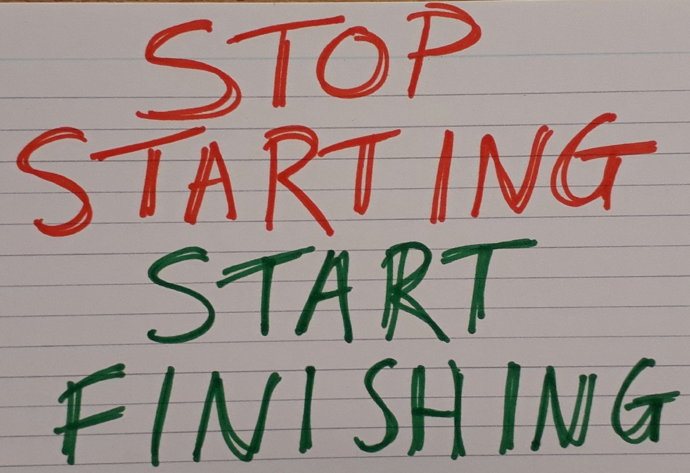

Back in October, my team was using scrum to deliver our service. Our service is relatively simple technologically, but requires a lot of analysis of policy and law, good content design, and thorough user research. Using scrum we found this work was either lumped outside of the sprints as product backlog refinement, or if it was included in the sprint we found user stories were being split according to the work to be done on it due to the work required (eg analyse and design feature X, do user research on feature X, develop feature X) so that they could be spread over sprints.

Using kanban has improved our visibility of what work is being done by the team, and prevented each stage of work on a feature from becoming uncoupled from each other. We have columns for the activities that need to happen for each story, and the majority of stories should move through every stage towards release. Visualising this flow has helped us to identify where bottlenecks in our delivery process are, and focus on improving the flow through these points. It has also improved our focus on delivering features rather than starting more and more analysis work, as we center our attention in each stand up on what has to be done to the cards to get them in a state to be released starting from the right hand side of the board.

Having work in progress limits has helped with the focus on delivery rather than starting new work. Each area of work has a work in progress limit, and this applies to work in that areas done column. If the next stage to delivery is overloaded and so isn’t picking up work, earlier stages quickly fill their WIP limits and are prevented from taking on more work. They have to do what they can to get cards completed and unblock the flow.

We have also used kanban to try to break down some of the silos that form between team members with different job roles. We have moved away from naming the work columns after job titles, and make them more descriptive of the activities happening. We are starting to recognise that much of the work each of us does, does not fit neatly into one column, and that we can provide value to the development of a feature throughout the delivery pipeline, rather than working to try and clear each story card from our inbox never to be seen again.

Recently, using kanban has supported our team in working on two separate streams of work (both related to the same project). We are able to easily visualise the dependencies between the two streams of work, and prioritise work unevenly across the two projects if needed, whilst keeping track of the teams capacity and ensuring total work in progress continues to be limited.

The flexibility of kanban has suited our team and the service we are providing during delivery. It has supported our sometimes rapidly changing priorities, improved team communication and collaboration, and provided much better visibility of our work and where in our workflow we can target for improvement.
