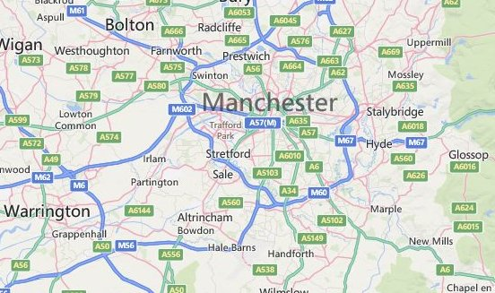
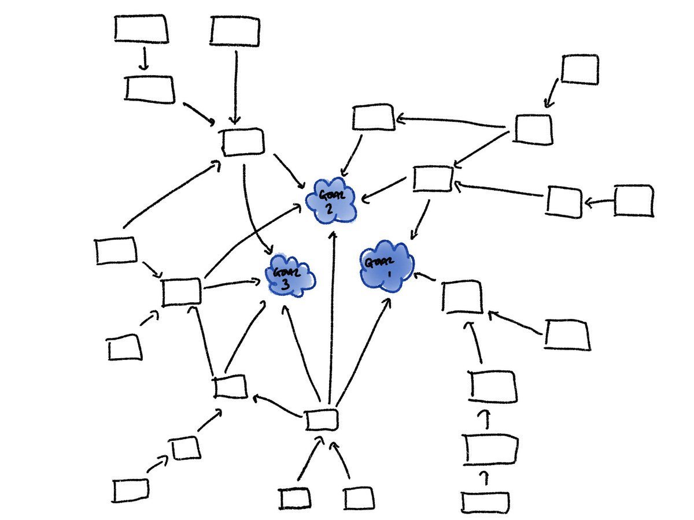
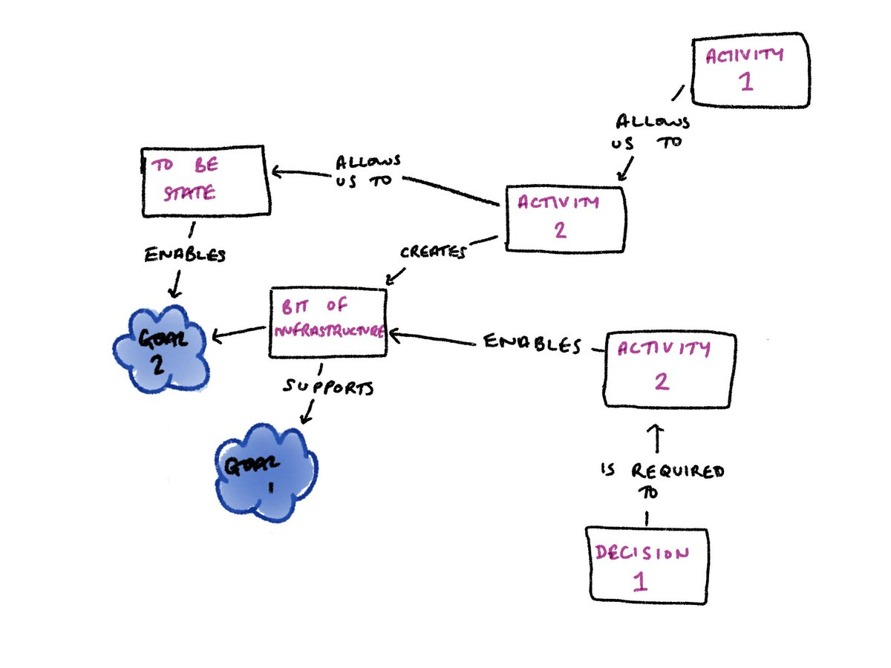

*written up from a twitter thread found [here](https://twitter.com/EleanorMollett/status/1143818859134234624)*

I've been thinking more about roadmaps recently and how they differ from delivery plans.

I might be being too literal, but to me a road map show clearly where you want to get to, shows the paths (multiple!) to get there, and the places you pass through on the way. If something blocks you, you can use it to reorientate yourself and continue on route.

*A road map of Manchester*

Most roadmaps I see look more like roads - they have a single path, give no room for different routes. They don't support a conversation of how to get there, or why you are taking that route. You can't always see how the path supports the goal.

*A very lovely road, but although it is the way I need to go I don't see how it leads to the end of the harbour*

Most of these are delivery plans.

They are useful.

They set out what you are delivering and when.

They lead to useful conversations, and help communicate delivery and dependencies.

Putting them together helps you learn.

They don't always effectively communicate your end goal, and they don't usually help you make decisions or change direction part way through.

I've written [before](https://eleanormollett.com/posts/radarban-roadmap/) about using radar style roadmaps - I think this sits between a delivery plan and a delivery roadmap. It can change, it supports decision making, but it fails to show the end goal, or link any of the deliverables to our goals.

I've recently been working with our infrastructure team on a roadmap to communicate all the things they want to do to make life easier for devs and improve our infrastructure.

We started listing out deliverables, and mapping out everything we might do to get there.

There were a couple of routes to several of them, so we captured that.

It became clear quickly that there were some clear goals the team had, and we could link to those.

Where we've ended up is a big network of things we can do to achieve our goals.

*A rough sketch of how activities link to our goals*

We labelled the links with what impact doing one node has on the next.

That helps us when explaining why we need to do some of the foundational work. That now clearly links to a goal, even if you have to traverse several subsequent nodes to get there.

*Detail from the roadmap showing how each activity supports the next and the end goals*

This gives you no information at all about delivery. But it's already kicked off discussions about what we can start, and who can help us.

Early days, but hopefully it will be useful, and is another alternative to delivery plans masquerading as roadmaps.
