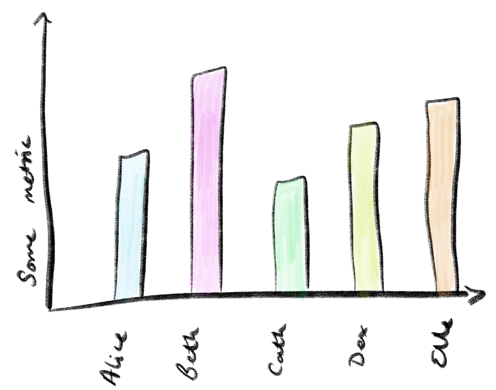

*written up from a twitter thread found [here](https://twitter.com/EleanorMollett/status/1171770376294150144)*

I’ve been thinking recently about team metrics, continuous improvement experiments, and consent.

As part of our teams’ efforts at continuous improvement, we often run experiments on working practices. Aside for the need for these to be driven by the whole team and not just by the delivery manager (a whole other train of thought!), these can go horribly wrong when it comes to wanting metrics on these experiments.

I’m going to assume you already understand that collecting data on your team to compare it with other teams is bad, and that you push back on this whenever you can.

Despite this, as a delivery manager it can still be tempting to collect metrics on your team – to demonstrate improvement or to satisfy your curiosity about an experiment you are running. Rightfully, we are recognising that evidence-based decision making is a good thing. You’ll probably justify this to yourself with the argument that these metrics will only be used within the team, that they won’t be used as management things to beat people with, and that you aren’t really comparing people with them.

*Do people really want to be measured like this?*

I’ve fallen into this trap before, and am lucky enough to have a team that will happily call me out on it.

If metrics aren’t selected and agreed by the team, they can be damaging. Whichever way you spin it, if you collect metrics on individuals, they are going to feel they are being compared to each other. If the data collection isn’t agreed to and owned by the team, not only is your data collection not ethical, but it can and will be gamed.

Some things to keep in mind when you want to collect team metrics:

* Is the data collection truly needed? Can the team try out the new way of working and evaluate if it has worked without it?

* Are you collecting the data to prove a point to someone (in management?) and if so, is the team supportive of this? 

* Will the data really remain internal, and if it won’t what might it be misused for?

At the end of the day, any metrics should be chosen, agreed to, and owned by the whole team.
