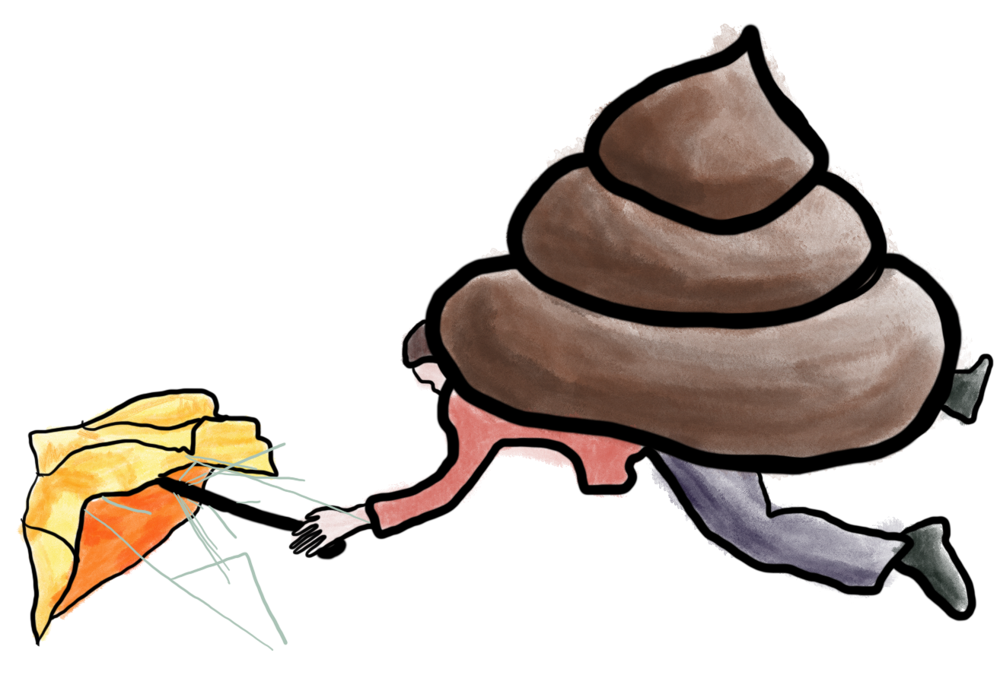

I heard about the concept of being the shit umbrella right at the beginning of my time as a delivery manager. In my experience, it's spoken of as a badge of honour by delivery and product managers, and often wistfully of managers by developers. Until recently it was something that I would have proudly proclaimed about myself, whilst hoping that people saw me that way rather than as the dreaded project manager. 

The theory goes that your most important contribution as a manager is to protect the team, so that they can get on with their work. It can cover everything from removing blockers and filtering requests, through to shielding them from bureaucracy, unsuitable governance, unreasonable and demanding stakeholders, criticism, nitpicks, and all the other distractions that exist when you are trying to create things. 

I can see why anyone would rather a manager who was a shit umbrella than a shit funnel. But when it starts becoming a badge of honour, things are starting to go wrong.

*Oof*

Often the shit you are protecting your team from comes from the rest of the organisation you are working in, from users, or from your higher ups. It tends to be because of different ways of working. Once you start inserting yourself between these people and your team, you are removing their exposure and isolating them. 

Whoever you are delivering for, your team should be as integrated with them as possible. The team needs to be able to understand the context you are working in. If you are getting unreasonable demands, the context that the team works in needs to be open too. Acting as a go between or translator hides away all the context, and inserts you as the only conduit to truly understand both.

If you are acting as a great translator, there will be no incentive to improve the friction between the different ways of working.

Sometimes there may be a need for some short term shielding. But the longer you protect the team and decide what to protect them from the more paternalistic you become. Managers who believe they are being shit umbrellas will start to withhold information and responsibility in the interest of protecting the team.

Interestingly, I’ve seen managers who act as shit umbrellas fall on both sides of a supposedly flat structure in a team. By acting paternalistically, they put themselves above the team. They also martyr themselves, often without a shit umbrella of their own. If you are a true part of the team (and you should be), you should be able to reach out for support and not need to be the only person who deals with crap. Over time the mental toll will grow of always dealing with shit, particularly if you have taken on the role of the lone shit umbrella.  If there is never ending shit falling and there is no one protecting you from it, if you can’t leave *(I hate advice that blithely suggests people just move jobs if a job sucks, as the ease of doing this directly correlates with a person's privilege)* you should not be acting as anyone else's shit umbrella. 

I think people wear the badge of honour of being a shit umbrella with good intentions. I doubt anyone calling themselves that sets out to remove responsibility from their team. But whilst it may be valuable in the short term, it is worth considering the impact in the long run.
