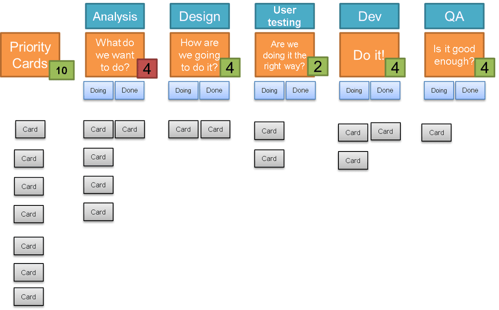
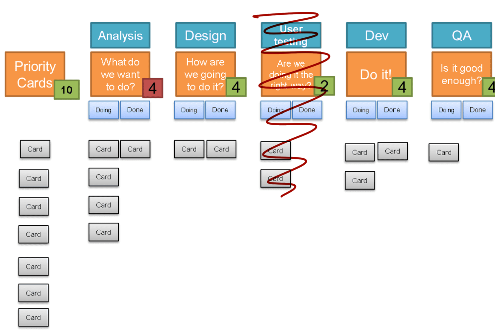
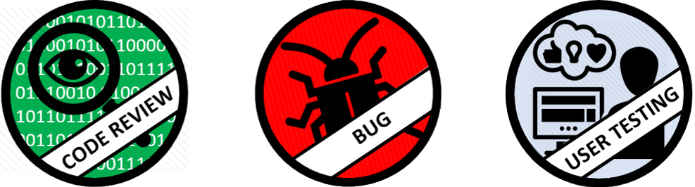
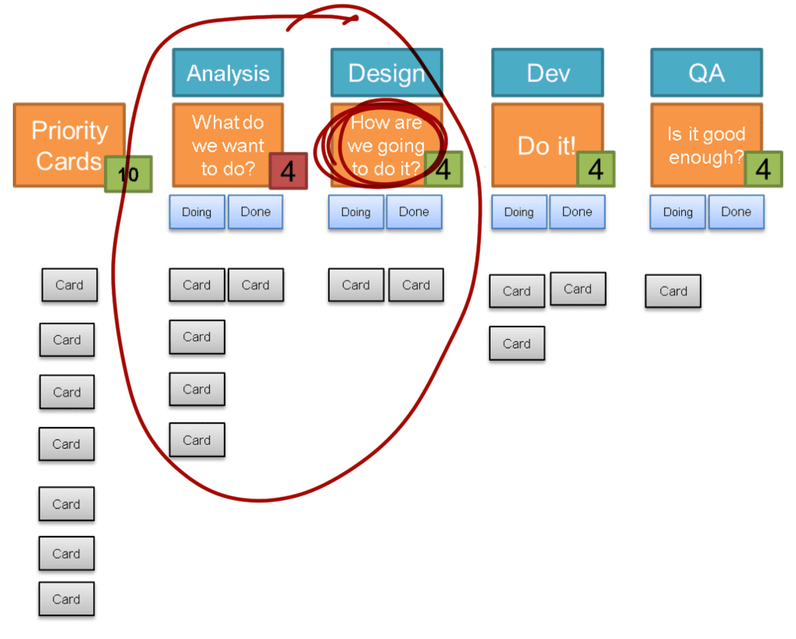

It's now over a month since we've been working remotely. Before this all happened I had been planning on writing a post about how we were steadily removing columns from our board, some of the techniques we had used to replace some columns, and what it had improved. Since going remote, we've reflected regularly about the board and our standups, and it has changed form again.

The starting point is the board I described in ["Anatomy of our kanban board"](/posts/the-anatomy-of-our-kanban-board/). This was my starting point because this was the workflow that the team was using at the time. It is really important that your current workflow is how your board starts out - if you try to start with an ideal board with an ideal workflow, you will always be fighting it. Any improvements to the board have to reflect actual improvements that have been made to how the team is working.

*analysis -> design -> user testing -> dev -> testing*

The first thing to go fairly early on was the user testing column. This went through quite a few iterations, becoming a section of the board aside from the columns, before finally we settled on having an indicator that would get stuck to whichever card was currently undergoing user testing. This worked best for us because the user testing could and did happen at any point in our workflow. When we started out, it was a definite stage that happened after design and before dev, but as we improved together, it became embedded in every stage of our work, and so the board changed to reflect this.

*analysis -> design -> dev -> testing*

This use of indicators continued for activities that I have seen as explicit columns on the board. We had a 3 amigos sticker, which really indicated that a conversation needed to happen on a card before it went any further, and we had a code review sticker to flag up that a card couldn't move further until it had been reviewed. This was in addition to the already existing bug and blocked stickers.

*code review, bug, user testing*

While we had started out with fairly distinct analysis and design stages, it became increasingly obvious that we were debating which column a card was currently in, as there was so much overlap between what people were doing and who was working on things. This included developers being much more involved in the analysis and design stages. This led to us merging those two columns into one, which worked really well for us particularly now we had so many stickers to indicate what kinds of conversations were needed about cards.

*how are we going to do it? -> do it -> is it good enough?*

This was where I had been planning on finishing this blog post. The team was working really well and closely, and our board had been refactored several times to reflect this.

However, since going remote, we've struggled with representing this on the ticketing software we currently use. I'm hoping that it is just a matter of configuring things to be closer to how we worked in person, but it feels much harder to map anything but a linear, stage by stage workflow within the software we use. This has meant that to be able to know what needs to happen next with a quick glance, we've had to add back in a lot of columns. The main difference is that the doing and done under a single column is gone, and split out into explicit columns. This isn't really an increase in columns, but it is a shame that we can't count the WIP limit across the two columns as we did before. Rather than stickers we have split statuses like "needs code review" into their own columns. 

While this is allowing us to see the information we used to be able to read quickly from our board, I do worry that while previously our work practices changed our board, that this time around our changes to the board might lead to changes in work practices and we'll become more linear with less collaborative working and more handoffs. It is something the team is keeping an eye on, as we really value the level of collaboration we had reached.

