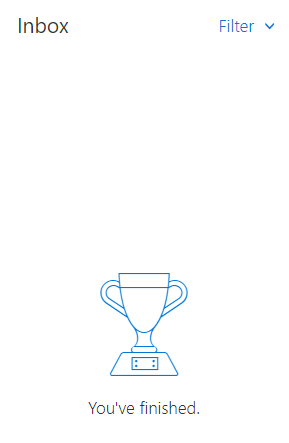

3 months ago I made a career change from being a delivery manager to being a developer. I've been making notes about things I've learned and noticed, which I would have found interesting when I was a delivery manager.

## Context switching
From listening to developers, I thought this was going to become an issue that I hadn't had before. It turns out that I’ve been dealing with context switching the whole time – as a delivery manager I was expected to be able to field a question about any of the 10 services we look after (often with people launching into the question without telling me which service it referred to!). I never really got to concentrate on anything, and I was pretty much always available. Now, I get to work on one thing at a time. It's great, and I am really enjoying getting to give something my full attention. Sometimes if I get something back from test I’ll have to switch between two services, but it will be from a much smaller pool of services. 

I do recognise this gets worse as you get more senior – I’d image our tech lead deals with a similar random array of queries as I did, but they will drag him out of concentrating in a much worse way.

## Busyness
I’ve found myself with a much more consistent stream of work to do – previously I would be stupid busy sometimes, and other times have literally nothing to do (hence why I started learning to code and picking up dev cards). Now I never have nothing to do, but am never in a mad rush.

## Being fed work
Part of this is because I’m working on tickets, which are lined up ready to go. There is always another card. As a delivery manager I was rarely fed work by anyone, it was whatever issue came up. I had some consistent work e.g. meetings and reports, but most of the work was fielding questions in one way or another. 

I’ve found it weird to start with having a to do list of work that other people have defined, even if it is cards that I was involved in the creation of. I had become very used to having a lot of independence and freedom over my own work. I can also see how it could be easy over time to just focus on the next card and not lift my head up to look at the bigger picture, so I want to keep an eye on this.

## Pairing is tiring
I had been warned about this, I thought I would be fine because hey, I’ve spent most of my previous job talking to people and working with them. Nope, completely different ball game, it is absolutely knackering. I love it though.

## Estimation
Another interesting one as it is something I had (and still have) strong views on. I don’t think it has changed my view on the futility of most estimating, but it has changed my perspective. Accuracy can seem much more important considering things card by card. As a delivery manager I always felt fairly secure that things would average out, because I only cared about the aggregate. Picking things up card by card, the estimate for that specific card can seem more important. 

## There is so much to learn
Which is amazing, and one of the reasons I switched. Even when I was busy as a delivery manager, I was bored. Things I struggled with generally didn’t have a knowledge or technical gap that I could study up on, they required either more experience, better human insight, or better interpersonal skills. These are all incredibly important, but not what excite me. Or they were intractable problems of time and resource that could never be fixed regardless of what you learned. Now I am sometimes overwhelmed by how much there is that can be learned, but loving getting to make a start at learning it.

The feeling reminds me a lot of my first few months in the lab starting my PhD. Back then it was machines I had no idea how to use, and people saying things like “just clone in the mutation then once you’ve purified the protein I can show you how to use the NMR”. The assumption is that the last part is the bit you need help with, but you don’t even know how to get started on the first part. I use this to remind myself that I did eventually know what I was doing. Also, that once I got to that point there was still a vast amount to learn.

## How I went about it
Good – Picking up the odd dev card when I had spare time meant I could learn over time during my existing job, and allowed me to learn that I enjoyed the work without making a risky jump. 

Bad – I wish I had had the confidence to do it sooner, although I am grateful for what I’ve learned as a delivery manager. 

Good – I’ve stayed on the same team that I used to be delivery manager for, which means I’m not having to learn the business context as well as the tech. 

Bad – This means I have had to be careful not to step on the new delivery managers toes.

## Working with a delivery manager
This has been a little weird, it helps that I am working with a great delivery manager. In the first month or so I actually had major impostor syndrome about my old job. Our new delivery manager is much better than I was at the people and team side of the job, and that made me seriously question how good I had been at what I was doing. I’ve come to terms now with the fact our strengths are different, and that is ok. Also, its not my job any more so it doesn’t really matter, and it gives me the fabulous chance to learn from her.

One thing I’m still not used to is retros. I liked to think when I was delivery manager that I was a full part of the team and we took part on the same playing field. Our team rotates the role of facilitating the retros, and I would take part. It is actually quite different in a creating rather than supporting role in a way I can't yet articulate. I still feel weird bringing stuff up (partly because I don’t want to step on toes), and it has made me seriously question how integrated delivery managers are into their own teams. This is something I want to think about/explore more at some point.

## Communication
I’ve realised that I had a very different early lockdown to the rest of my team. I didn’t feel that isolated – and that is because I was in meetings every day, spoke 1:1 with a different team member each day to check up on how they were doing, and was generally communicating a lot. Other teams dropped away, but I felt no drop off in my communication with my team. I now can go for ages without talking 1:1 with some members of the team, and other teams have dropped away even more as I’m not going to the cross team meetings I used to. Pros – no more listening to the same cross team updates a million times a week. Cons – I’m getting used to not really knowing that much about what is going on outside my bubble.

Linked to the context switching – I do much less communicating than I did before. I get fewer messages on teams, and I get barely any emails. I can see why most the devs I’ve worked with don’t really check their email inboxes – I’ve often got nothing in there. I certainly never saw inbox 0 as a delivery manager!

*I've finished? I've no emails to reply to? What??*

## Random other bits
* Delivering through others is important, but it isn’t for everyone. If you don’t enjoy it, management might not be for you, and that is ok.
* Just because a job is important doesn’t mean you have to be the one doing it.
* The unit of delivery is the team – I heard this when I first started in delivery at a talk by GDS. It made absolutely no sense what so ever to me, until I was part of a really good team. I want to make sure I keep it in mind.

## I don’t regret switching careers
I am really enjoying the work, and feel the type of work suits me much better. This doesn’t stop me  regularly thinking “oh god I’ve gone mad what have I done”. Less though each month. 
